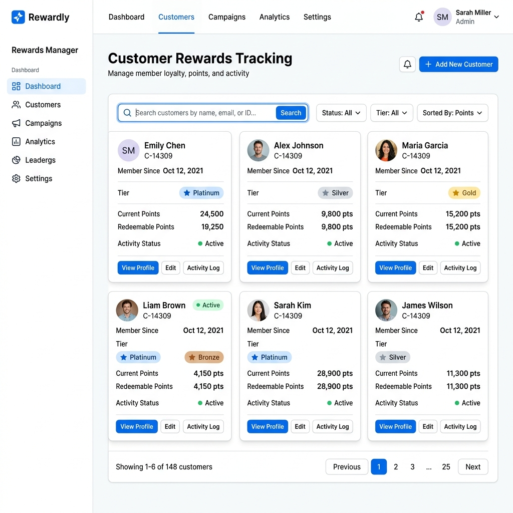
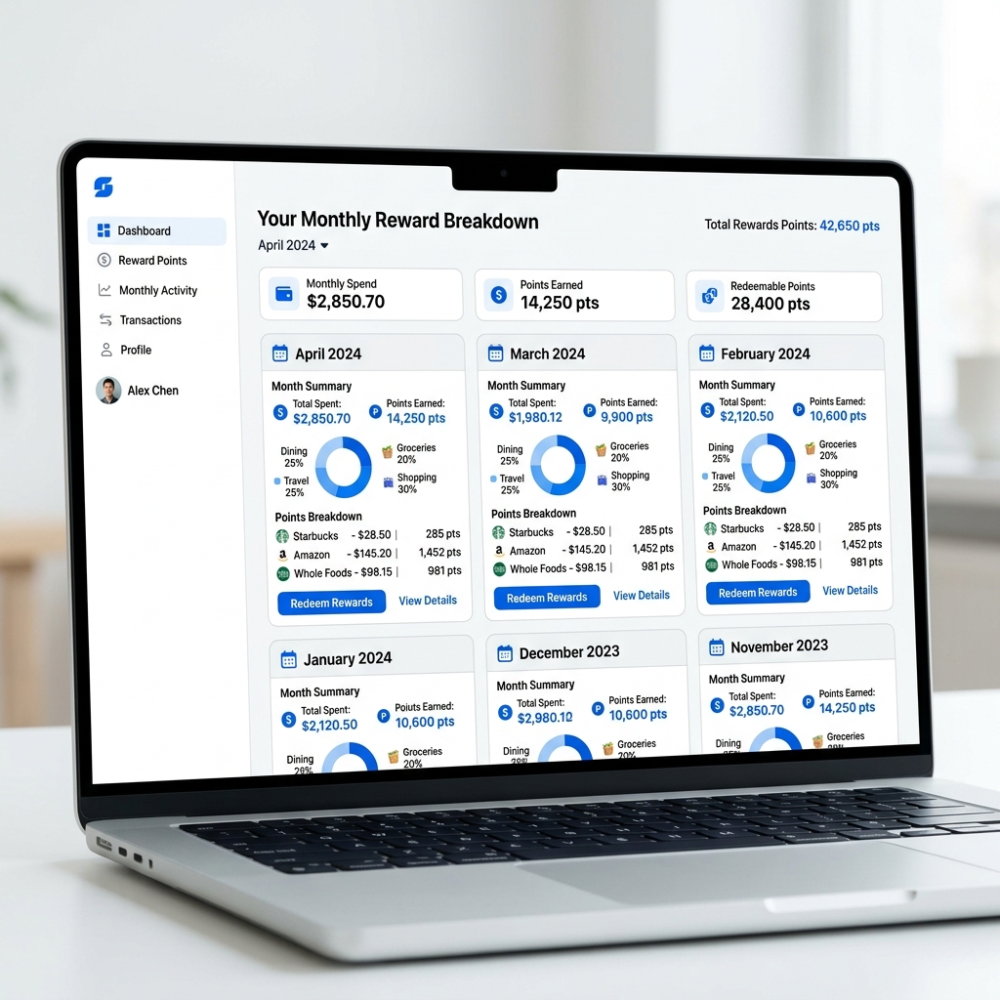
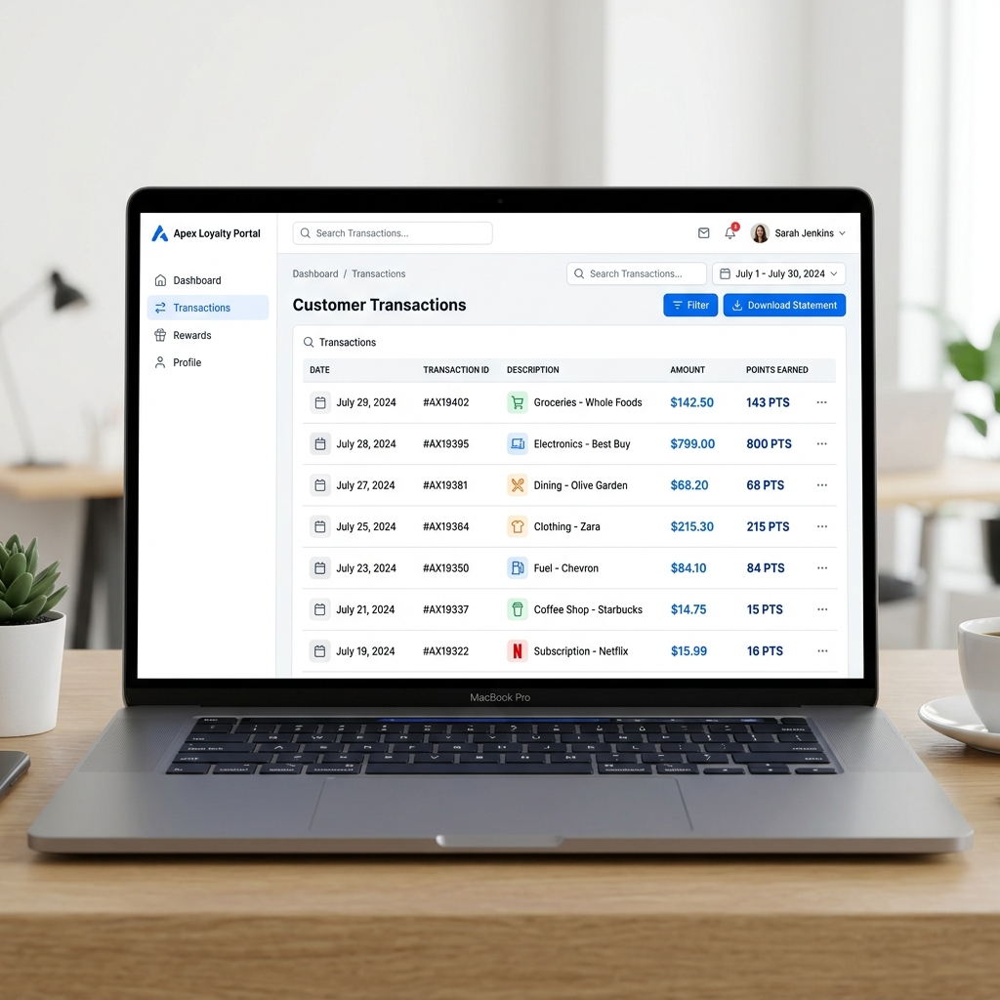
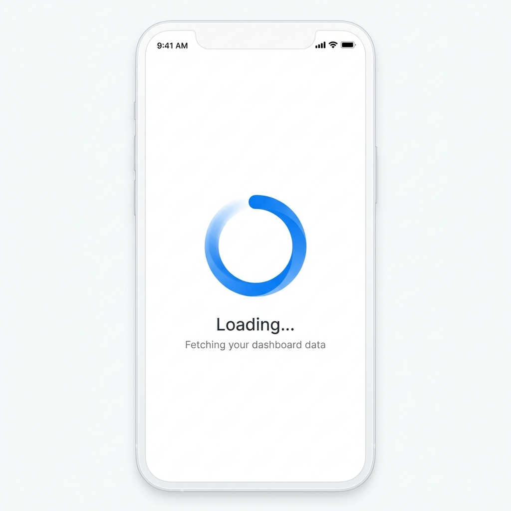
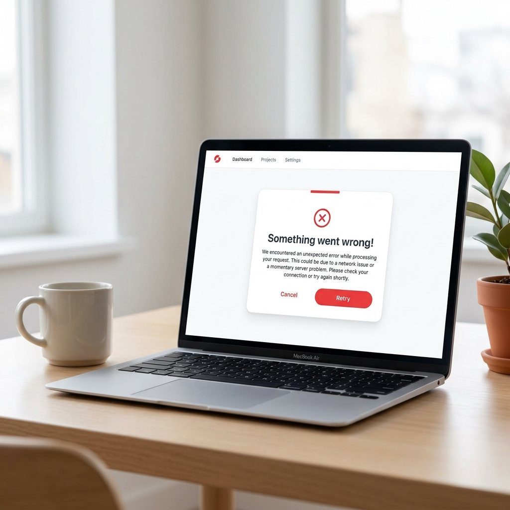
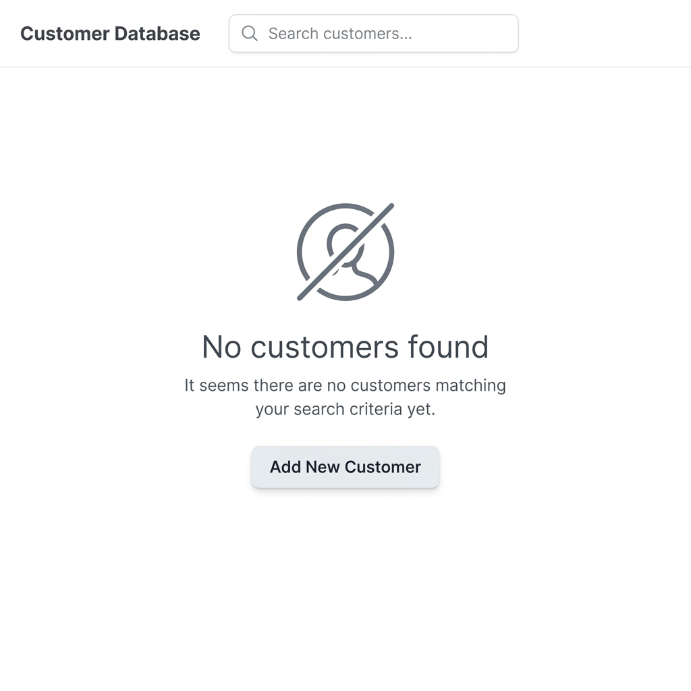
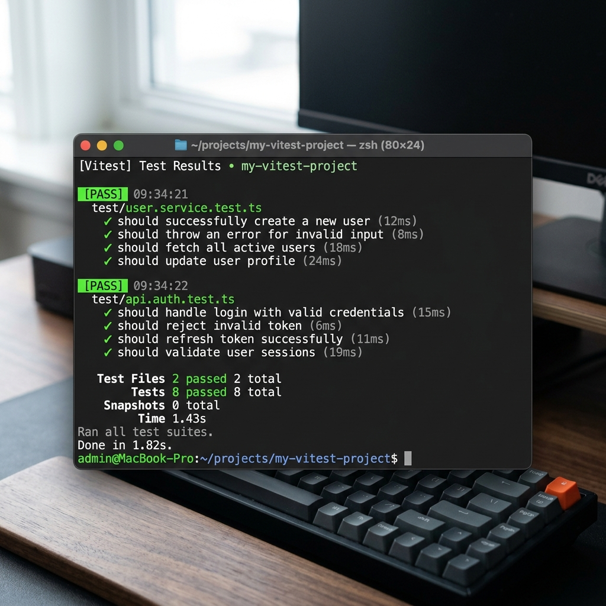

<div align="center">
  <h1>🏆 Customer Rewards Dashboard</h1>
  <p><strong>A modern, responsive React application for tracking and calculating customer reward points.</strong></p>
  
  [](https://reactjs.org/)
  [](https://vitejs.dev/)
  [](https://reactrouter.com/)
  [](https://vitest.dev/)
</div>

<br />

## 📖 App Overview

The **Customer Rewards Dashboard** is designed to calculate and display reward points based on a retailer's customer transaction data. It processes simulated asynchronous transactions, dynamically converting spent amounts into reward points using a specific formula: 

> 💡 **Reward Formula**: 
> - **2 points** for every dollar spent over $100 in each transaction.
> - **1 point** for every dollar spent between $50 and $100 in each transaction.

The app provides a seamless multi-view UI, allowing users to drill down from a high-level dashboard to detailed monthly point breakdowns and individual transaction histories.


## 🚀 Tech Stack

| Category | Technology | Description |
| --- | --- | --- |
| **Frontend** | React 19 | Hooks, Functional Components |
| **Routing** | React Router DOM v7 | Client-side routing |
| **Build Tool** | Vite | Lightning-fast development server |
| **Styling** | Vanilla CSS | Custom, responsive UI design |
| **Testing** | Vitest | Unit testing for core logic |
| **Linting** | ESLint | Code quality and consistency |

---

## 📂 Folder Structure

A modular and scalable architecture:

```text
src/
├── api/                  # API simulation and data fetching functions
├── assets/               # Static assets (images, icons)
├── components/           # Reusable UI components
│   ├── common/           # Shared (Pagination, SearchBar, Loader, ErrorMessage)
│   ├── customer/         # Customer-specific (CustomerCard, CustomerList)
│   └── transaction/      # Transaction-specific (TransactionCard, TransactionList)
├── constants/            # Global application constants
├── hooks/                # Custom React hooks (e.g., useTransactions)
├── pages/                # High-level route views (Dashboard, Breakdown)
├── routes/               # Centralized routing configuration
├── services/             # Core business logic and data aggregation
├── styles/               # Global styling and CSS variables
├── tests/                # Unit tests for business logic
└── utils/                # Helper functions (calculators, formatters)
```

---

## ⚙️ Project Setup and Installation

Follow these steps to run the project locally.

### Prerequisites
- **Node.js** (v18 or higher recommended)
- **npm** or **yarn**

### Quick Start

1. **Navigate to the project directory**:
   ```bash
   cd Customer_app
   ```

2. **Install all dependencies**:
   ```bash
   npm install
   ```

3. **Spin up the dev server**:
   ```bash
   npm run dev
   ```
   > 🌐 Open your browser and visit: `http://localhost:5173/`

4. **Run the test suite**:
   ```bash
   npm run test
   ```

---

## 🧩 Component Details

The UI is built with reusability in mind:
- 🛠 **Common**: 
  - `SearchBar`: Dynamic filtering.
  - `Pagination`: Effortless list navigation.
  - `Loader` & `ErrorMessage`: Graceful state handling.
- 🧑‍🤝‍🧑 **Customer**: 
  - `CustomerList`, `CustomerCard`, `CustomerSummary` for displaying profile grids and top-level stats.
- 💳 **Transaction**: 
  - `MonthlyBreakdownCard` for aggregated points.
  - `TransactionList` & `TransactionCard` for granular details.

---

## 🧠 Solution Details

- **Architecture**: A clean separation of concerns. UI components handle presentation, custom hooks (`useTransactions`) manage state/effects, and utility services handle the heavy lifting.
- **Data Fetching**: `transactionApi.js` simulates async data fetching from a mock JSON endpoint, using synthetic delays to mimic real-world network latency.
- **Business Logic**: `rewardCalculator.js` contains the pure function logic for point calculation, while `rewardService.js` aggregates this data by customer and month.
- **State Management**: Built-in React hooks (`useState`, `useEffect`, `useMemo`) are used effectively to manage sorting, pagination, and data caching.

---

## 🧪 Testing Scenario

Robust business logic is ensured via **Vitest**.
- **Test File**: `tests/rewardCalculator.test.js`
- **What's tested?**
  - Transactions `<= $50` correctly yield **0 points**.
  - Transactions between `$50` and `$100` correctly calculate **1 point per dollar**.
  - Transactions over `$100` correctly apply the mixed formula (e.g., `$120` = `50*1 + 20*2 = 90 points`).
  - Graceful handling of edge cases, decimals, and negative inputs.

---

## 🔄 Working Flow of App

1. **Dashboard Load**: The app hits the mock API asynchronously. A sleek loading spinner is shown.
2. **Overview**: The `DashboardPage` renders a paginated, sortable, and searchable list of all customers, showing total rewards and spend.
3. **Monthly Drilldown**: Clicking a customer card navigates to the `CustomerBreakdownPage`, displaying high-level stats and a grid of monthly point breakdowns.
4. **Transaction Details**: Clicking a specific month navigates to the `TransactionDetailsPage`, revealing a paginated log of every transaction made during that period.
5. **Seamless Navigation**: Users can easily traverse back and forth without losing context.

---

## 🖼️ Application Screenshots

### 1. Dashboard (with search + pagination)


### 2. Customer Breakdown (monthly cards)


### 3. Transaction Details (scrollable list)


### 4. Application States

<details>
  <summary><strong>Loading State</strong></summary>
  <br>
  
</details>

<details>
  <summary><strong>Error State</strong></summary>
  <br>
  
</details>

<details>
  <summary><strong>Empty State</strong></summary>
  <br>
  
</details>

### 5. Test Run Success

